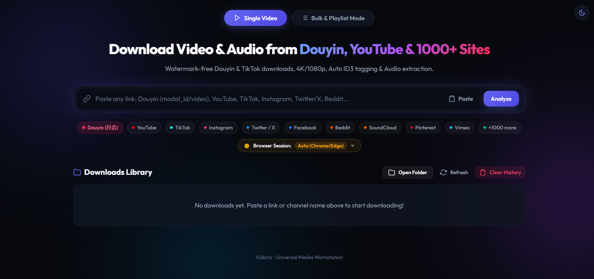

# Vidora — Universal Media & Video Workstation

<p align="center">
  
</p>

A fast, lightweight, and modern standalone media workstation built with **FastAPI**, **Vanilla JS**, and **yt-dlp**.

Supports single links, channels, playlists, and bulk batches across **Douyin (抖音)**, **YouTube**, **TikTok**, **Instagram**, **X (Twitter)**, **Facebook**, **Reddit**, and 1000+ platforms.

---

## ⚡ Key Features

1. **Watermark-Free Douyin & TikTok Extractor**: Direct, lossless MP4 video and MP3 audio stream extraction.
2. **Channel & Profile Bulk Extractor**: Paste `@channel` handles or playlists from YouTube, TikTok, and Instagram, with instant sorting between 🎬 **Long Videos** and ⚡ **Shorts & Reels**.
3. **In-Browser Session & Cookie Support**: Extract and download private, members-only, or login-restricted media directly from your active browser session (Chrome, Edge, Firefox, Brave) or custom `cookies.txt`.
4. **Clean Text Transcripts (`.txt`)**: Download spoken audio transcripts as clean `.txt` files with timestamps.
5. **Bulk / Playlist Batch Downloader**: Paste multiple links (one per line) and batch download with one click.
6. **Dynamic Concurrency & Speed Control**: Configure simultaneous downloads (1, 2, 3, 4, 5, 8 at a time) with crash-proof async worker queues.
7. **4-Column Ongoing Downloads Grid**: Real-time download speed (`MB/s`), progress bars, and ETA indicators.
8. **Pause, Resume & Cancel Controls**: Pause active downloads to conserve bandwidth, resume at any time.
9. **Dual Run Modes**: Run as a **Web Browser App** or as a **Standalone Native Desktop App**.
10. **Timestamp Clip Extractor**: Trim and download specific video segments locally with zero quality loss.
11. **In-Browser Media Player**: Preview and playback downloaded audio and video directly in the browser.
12. **Dark / Light Mode**: Floating glassmorphic theme switcher.
13. **Non-Destructive History Management**: Clear history from the UI while keeping physical files safe on your hard drive.

---

## 🚀 Quick Start (Local & 100% Free)

No API keys, third-party subscriptions, or tokens required.

1. **Install dependencies**:
   ```bash
   pip install -r requirements.txt
   ```

2. **Launch Options**:
   - 🖥️ **Desktop App Mode**: Double-click `run-app.bat`
   - 🌐 **Web Browser Mode**: Double-click `runbrowser.bat`
   - ⚡ **CLI / Terminal**: `python server.py` and open [http://localhost:8000](http://localhost:8000)

---

## 📂 Project Structure

```
├── server.py              # FastAPI backend & async worker queue
├── douyin_extractor.py    # Dedicated Douyin extractor
├── desktop_launcher.py    # Native desktop window bootstrap
├── run-app.bat            # Desktop App one-click launcher
├── runbrowser.bat         # Web Browser one-click launcher
├── static/
│   ├── index.html         # Modern web interface
│   ├── style.css          # Glassmorphic responsive styles
│   └── app.js             # Real-time state & API controllers
├── downloads/             # Local download target folder
├── requirements.txt       # Python dependencies
└── .gitignore             # Excludes downloads, cookies, and cache
```

---

## 🔒 Privacy & Local Storage

All operations run entirely on your local machine (`127.0.0.1:8000`). No data, links, or media files are ever sent to third-party external servers.
